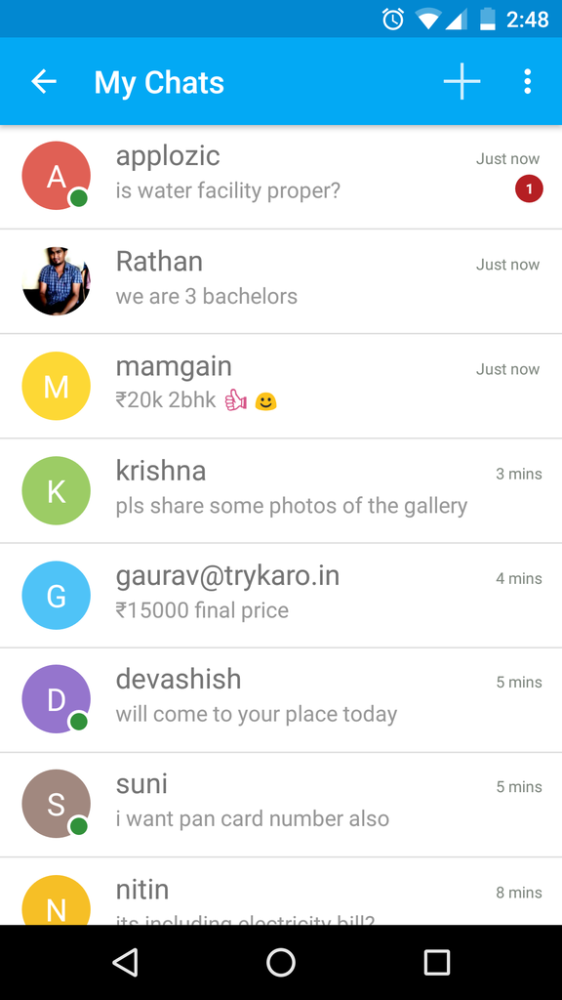

# Applozic-Android-SDK
Applozic-Android-SDK


### Overview         

Open source Chat and Messaging SDK that lets you add real time messaging in your mobile (android, iOS) applications and website.

Signup at https://www.applozic.com to get the application id.





Features:


 One to one and Group Chat
 
 Image capture
 
 Photo sharing
 
 File attachment
 
 Location sharing
 
 Push notifications
 
 In-App notifications
 
 Online presence
 
 Last seen at 
 
 Unread message count
 
 Tying indicator
 
 Message sent, delivery report
 
 Offline messaging
 
 Multi Device sync
 
 Application to user messaging
 
 Customized chat bubble
 
 UI Customization
 
 Cross Platform Support (iOS, Android & Web)


### Getting Started       


###### Quick Start for Applozic Messaging   

To integrate chat into your android app, signup at [Applozic](https://www.applozic.com/signup.html?utm_source=android&utm_medium=github) to get the application key.

**Step 1: Add the following in build.gradle**:      


`compile 'com.applozic.communication.uiwidget:mobicomkitui:3.21' `      


Add the following in gradle android target:      


```
packagingOptions    
 {           
 exclude 'META-INF/DEPENDENCIES'      
 exclude 'META-INF/NOTICE'         
 exclude 'META-INF/LICENSE'      
 exclude 'META-INF/LICENSE.txt'    
 exclude 'META-INF/NOTICE.txt'
 exclude 'META-INF/ECLIPSE_.SF'
 exclude 'META-INF/ECLIPSE_.RSA'
 }                
```

**Step 2: Addition of Permissions, Services and Receivers in androidmanifest.xml**:

Applozic Application Key:     


```
<meta-data android:name="com.applozic.application.key"
           android:value="YOUR_APPLOZIC_APPLICATION_KEY" /> 

```         
   
Applozic Application URL:        
   
   
   ```
<meta-data android:name="com.applozic.server.url"
           android:value="https://apps.applozic.com" /> 
   ```
 Applozic MQTT URL:
 
 ```
 <meta-data android:name="com.applozic.mqtt.server.url"
            android:value="tcp://apps.applozic.com" />
   ```
   
 Applozic Notification package name and launcher icon:        
 
 
```
<meta-data android:name="com.applozic.mobicomkit.notification.icon" 
           android:resource="YOUR_LAUNCHER_ICON" />  
          
```   
```
<meta-data android:name="com.applozic.mobicomkit.notification.smallIcon"
           android:resource="YOUR_LAUNCHER_SMALL_ICON" />
```
```
<meta-data android:name="com.package.name" 
           android:value="${applicationId}" /> 
           
```
   
   
   **Note**: If you are **not using gradle build** you need to replace ${applicationId}  with your Android app package name

Invite Message:


```
<meta-data android:name="share_text"
          android:value="YOUR INVITE MESSAGE" />
  ```

Attachment Folder configuration:         


    
```
<meta-data android:name="main_folder_name"
           android:value="@string/default_media_location_folder" /> 
```
  
  Define below in your string.xml.          
  
  
     
```
<string name="default_media_location_folder"><YOUR_APP_NAME></string> 
```
  


Permissions:          


```
<uses-permission android:name="<APP_PKG_NAME>.permission.C2D_MESSAGE" />
<permission android:name="<APP_PKG_NAME>.permission.C2D_MESSAGE" android:protectionLevel="signature" />
<uses-permission android:name="com.google.android.c2dm.permission.RECEIVE" />
<uses-permission android:name="android.permission.INTERNET" />
<uses-permission android:name="android.permission.WRITE_EXTERNAL_STORAGE"  />
<uses-permission android:name="android.permission.READ_CONTACTS" />
<uses-permission android:name="android.permission.WRITE_CONTACTS" />
<uses-permission android:name="android.permission.VIBRATE"/>
<uses-permission android:name="android.permission.WAKE_LOCK" />
<uses-permission android:name="android.permission.RECEIVE_BOOT_COMPLETED" />
<uses-permission android:name="android.permission.ACCESS_COARSE_LOCATION" />
<uses-permission android:name="android.permission.ACCESS_FINE_LOCATION" />
<uses-permission android:name="android.permission.ACCESS_NETWORK_STATE" />
<uses-permission android:name="android.permission.READ_EXTERNAL_STORAGE"/>
  ```


Broadcast Registration For PushNotification:        


   
```
<receiver android:name="com.applozic.mobicomkit.uiwidgets.notification.MTNotificationBroadcastReceiver">
   <intent-filter>            
        <action android:name="${applicationId}.send.notification"/>                    
   </intent-filter>           
</receiver>                  
```

**Note**: If you are **not using gradle build** you need to replace ${applicationId}  with your Android app package name


Paste the following in your androidmanifest.xml:       


   
```
 <activity android:name="com.applozic.mobicomkit.uiwidgets.conversation.activity.ConversationActivity"
           android:configChanges="keyboardHidden|orientation|screenSize"
           android:label="@string/app_name"
           android:parentActivityName="<APP_PARENT_ACTIVITY>"
           android:theme="@style/ApplozicTheme"
           android:launchMode="singleTask" >
      <!-- Parent activity meta-data to support API level 7+ -->
<meta-data
           android:name="android.support.PARENT_ACTIVITY"
           android:value="<APP_PARENT_ACTIVITY>" />
 </activity>
                   
<activity android:name="com.applozic.mobicomkit.uiwidgets.people.activity.MobiComKitPeopleActivity"
          android:configChanges="keyboardHidden|orientation|screenSize"
          android:label="@string/activity_contacts_list"
          android:parentActivityName="com.applozic.mobicomkit.uiwidgets.conversation.activity.ConversationActivity"
          android:theme="@style/Applozic.People.Theme"
          android:windowSoftInputMode="adjustResize">
     <!-- Parent activity meta-data to support API level 7+ -->
<meta-data
          android:name="android.support.PARENT_ACTIVITY"
          android:value="com.applozic.mobicomkit.uiwidgets.conversation.activity.ConversationActivity" />
         <intent-filter>
                 <action android:name="android.intent.action.SEARCH" />
         </intent-filter>
<meta-data
          android:name="android.app.searchable"
          android:resource="@xml/searchable_contacts" />
</activity>

<activity android:name="com.applozic.mobicomkit.uiwidgets.conversation.activity.FullScreenImageActivity"
          android:configChanges="keyboardHidden|orientation|screenSize"
          android:label="Image"
 android:parentActivityName="com.applozic.mobicomkit.uiwidgets.conversation.activity.ConversationActivity"
          android:theme="@style/Applozic_FullScreen_Theme">
    <!-- Parent activity meta-data to support API level 7+ -->
<meta-data
          android:name="android.support.PARENT_ACTIVITY"
          android:value="com.applozic.mobicomkit.uiwidgets.conversation.activity.ConversationActivity" />
</activity>
                   
<service android:name="com.applozic.mobicomkit.api.conversation.MessageIntentService"
          android:exported="false" />
              
<service android:name="org.eclipse.paho.android.service.MqttService"/>

<service android:name="com.applozic.mobicomkit.api.conversation.ApplozicIntentService"
         android:exported="false" />
             
<service android:name="com.applozic.mobicomkit.api.conversation.ApplozicMqttIntentService"
         android:exported="false" />

<receiver android:name="com.applozic.mobicomkit.broadcast.NotificationBroadcastReceiver">
         <intent-filter>
                 <action android:name="applozic.LAUNCH_APP" />
         </intent-filter>
<meta-data
          android:name="activity.open.on.notification"
          android:value="com.applozic.mobicomkit.uiwidgets.conversation.activity.ConversationActivity" />
</receiver>

<receiver android:name="com.applozic.mobicomkit.broadcast.TimeChangeBroadcastReceiver">
         <intent-filter>
                 <action android:name="android.intent.action.TIME_SET" />
                 <action android:name="android.intent.action.TIMEZONE_CHANGED" />
         </intent-filter>
</receiver>

<receiver android:name="com.applozic.mobicomkit.broadcast.ConnectivityReceiver"
          android:exported="true" android:enabled="true">
          <intent-filter>
                  <action android:name="android.intent.action.BOOT_COMPLETED" />
                  <action android:name="android.net.conn.CONNECTIVITY_CHANGE" />
          </intent-filter>
</receiver>                  
```


Replace APP_PARENT_ACTIVITY with your app's parent activity.        

**Step 3: Register user account**:     


     
```
UserLoginTask.TaskListener listener = new UserLoginTask.TaskListener() {                  

@Override          
public void onSuccess(RegistrationResponse registrationResponse, Context context)         
{              
}                       

@Override             
public void onFailure(RegistrationResponse registrationResponse, Exception exception)         
{         
}};                      

User user = new User();          
user.setUserId(userId); 
user.setDisplayName(displayName); 
user.setEmail(email); //optional                        
new UserLoginTask(user, listener, this).execute((Void) null);                                      
```

If it is a new user, new user account will get created else existing user will be logged in to the application.

**Step 4: Updating GCM registration id:**

In case, if you don't have the existing GCM related code, then copy the files from https://github.com/AppLozic/Applozic-Android-SDK/tree/master/app/src/main/java/com/applozic/mobicomkit/sample/pushnotification
to your project and add the following lines in the "onSuccess" method mentioned in Step 3.

To Enable Android Push Notification using Google Cloud Messaging (GCM) visit the below link 
https://blog.applozic.com/enable-push-notification-in-your-android-app-ae591de461e7#.q086bfbgv

After Registering project at https://console.developers.google.com
Replace the value of GCM_SENDER_ID in GCMRegistrationUtils.java with your own project gcm sender id.
SenderId is a unique numerical value created when you configure your API project (given as "Project Number" in the Google Developers Console).            


```
 GCMRegistrationUtils gcmRegistrationUtils = new GCMRegistrationUtils(activity);          
 gcmRegistrationUtils.setUpGcmNotification();                      
```

If you already have a GCM code in your app, then copy the following code at the place where you are getting the GCM registration id.       
     
```
PushNotificationTask pushNotificationTask = null         
PushNotificationTask.TaskListener listener = new PushNotificationTask.TaskListener()   
{                  

@Override           
public void onSuccess(RegistrationResponse registrationResponse)             
{            
}            
@Override          
public void onFailure(RegistrationResponse registrationResponse, Exception exception)      
{             
} };                    

pushNotificationTask = new PushNotificationTask(pushnotificationId, listener, mActivity);            
pushNotificationTask.execute((Void) null);                          
```


**Step 5: Handling push notification**:
Add the following in your GcmBroadcastReceiver's onReceive method.     


       
```
if(MobiComPushReceiver.isMobiComPushNotification(intent))       
{            
MobiComPushReceiver.processMessageAsync(context, intent);               
return;          
}                     
```


**Step 6: For starting the messaging activity**:        

      
```
Intent intent = new Intent(this, ConversationActivity.class);            
startActivity(intent);                               
``` 
 
 
 For starting individual conversation thread, set "userId" in intent:        
 
           
```
Intent intent = new Intent(this, ConversationActivity.class);            
intent.putExtra(ConversationUIService.USER_ID, "devashish@applozic.com");             
intent.putExtra(ConversationUIService.DISPLAY_NAME, "Devashish Mamgain"); //put it for displaying the title.             
startActivity(intent);                              
```


For easy insertion of Admin/Support Contact information, please changes following values in string.xml. You can take sample app method ( MainActivity.buildSupportContactData() ) as reference for contact information insertion.          


          
```
<string name="support_contact_display_name">AppLozic Support</string>               
<string name="support_contact_userId">applozic</string>             
<string name="support_contact_emailId">devashish@applozic.com</string>              
<string name="support_contact_number">918042028425</string>              
<string name="support_contact_image_url">R.drawable.ic_launcher</string>                                  
```

support_contact_image_url also supports url eg:
 https://www.applozic.com/resources/sidebox/images/applozic.png

**Step 7: On logout, call the following**:       


 new UserClientService(this).logout();      
 
 
 
 Note: If you are running ProGuard, please add following lines:        
 
 
 
 
 
```
 #keep json classes                
 -keepclassmembernames class * extends com.applozic.mobicomkit.api.JsonMarker         
 {            
 !static !transient <fields>;                  
 }              
 #GSON Config          
-keepattributes Signature          
-keep class sun.misc.Unsafe { *; }           
-keep class com.google.gson.examples.android.model.** { *; }            
-keep class org.eclipse.paho.client.mqttv3.logging.JSR47Logger { *; }                                    
 ``` 
   
   
   
   
Trying out the demo app:

Open project in Android Studio to run the sample app in your device. Send messages between multiple devices. 


Display name for users:
You can either choose to handle display name from your app or have Applozic handle it.
From your app's first activity, set the following to disable display name feature:
ApplozicClient.getInstance(this).setHandleDisplayName(false);
By default, the display name feature is enabled.

For more details, visit: https://www.applozic.com/developers.html#android-sdk-getting-started

Applozic is the best android chat sdk, still not convinced? Write to us at github@applozic.com and we will be happy to schedule a demo for you.
